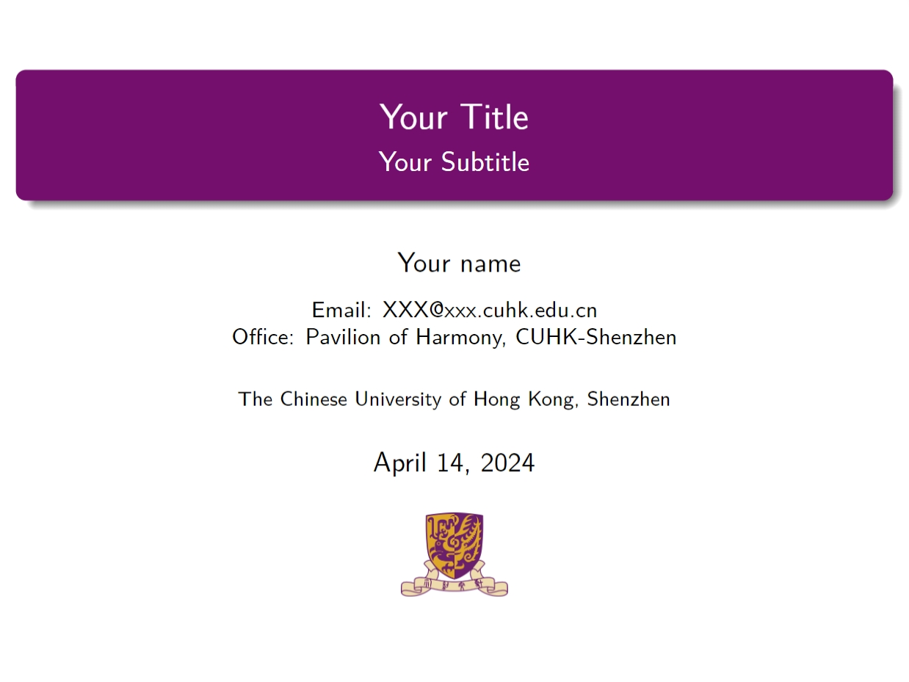
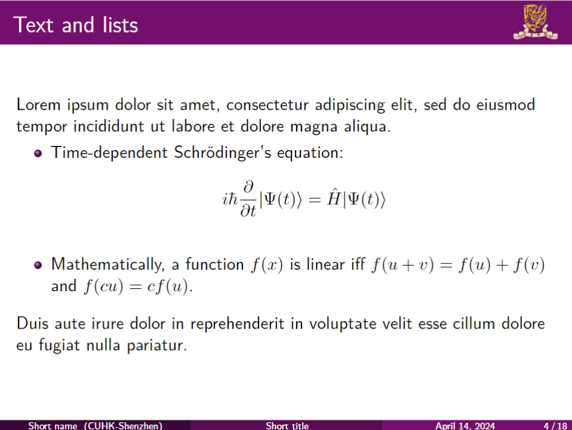
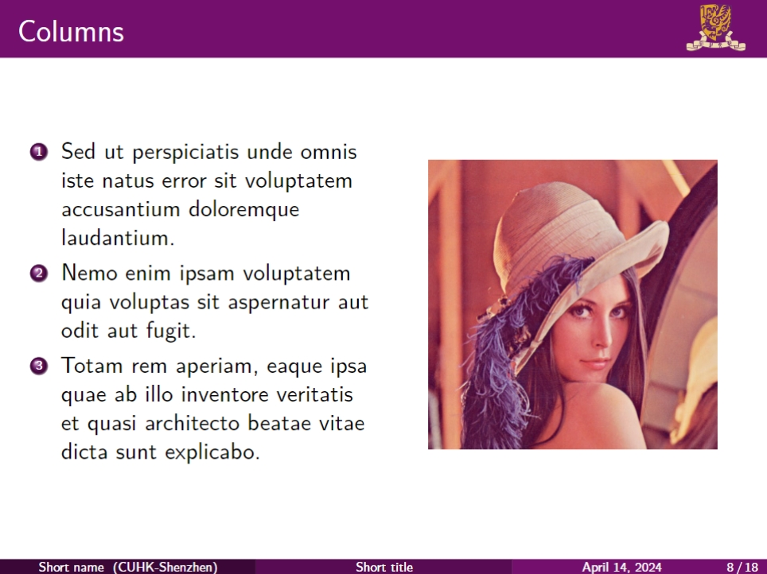
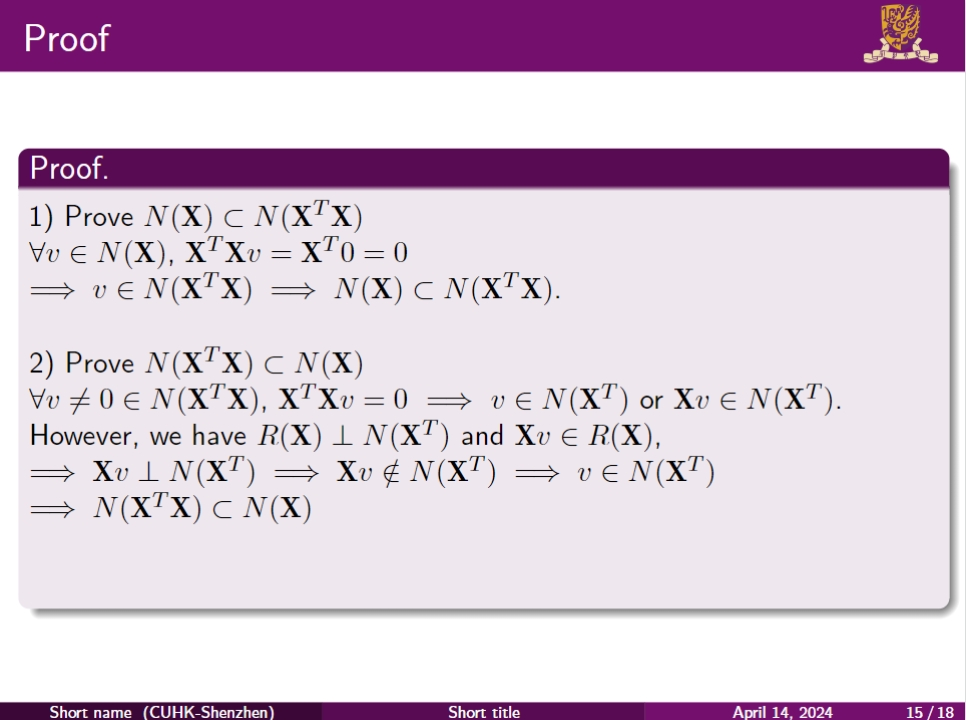
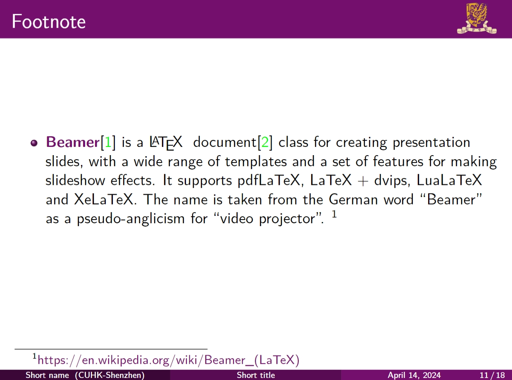
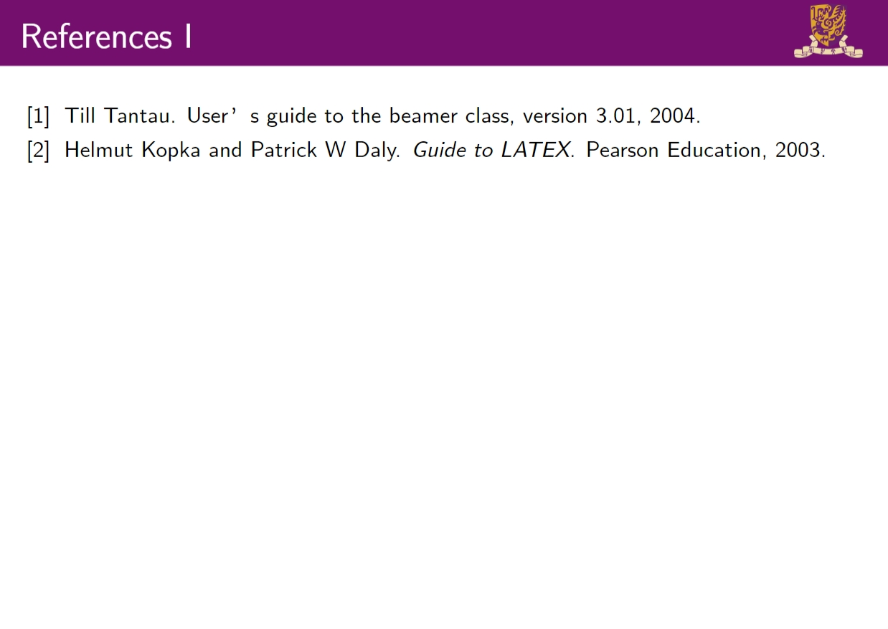

# CUHK Beamer Template

Beamer template with CUHK/CUHK-Shenzhen colors and logos. Please be noted that this is **NOT** an official template.

This template is adapted from <https://github.com/mssun/cuhk-beamer> and <https://github.com/yuehaowang/CUHK-Beamer-Template>.

## Demo

Please refer to 'sample.tex' for the usage.

## License

 
This work is licensed under a <a rel="license" href="http://creativecommons.org/licenses/by-sa/2.0/">Creative Commons Attribution-ShareAlike 2.0 Generic License</a>.